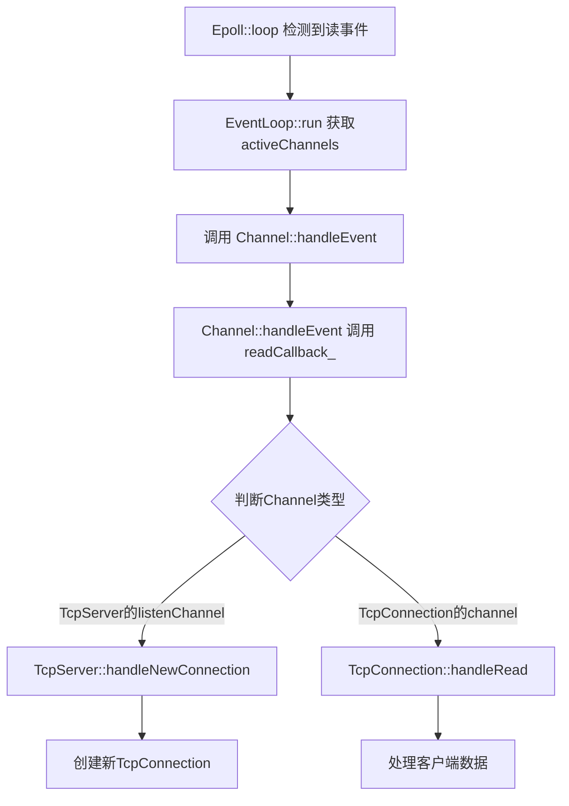

## My Reactor Patern (not fully implemented)


```
让ai翻译的，自己整理在notes.txt
```

# TCP服务器事件处理流程

## 整体流程概述

```
main() 
  ↓
TcpServer::start() 
  ↓
EventLoop::run() 
  ↓
Epoll::loop() 
  ↓
Channel::handleEvent()
```

## 详细执行流程

### 1. 程序启动阶段

```cpp
// main函数中
TcpServer tcpServer;
tcpServer.start();  // 启动TCP服务器
```

### 2. 事件循环启动

```cpp
// TcpServer::start() 内部调用
eventLoop->run();
```

### 3. Epoll事件监听

```cpp
// EventLoop::run() 内部
vector<Channel*> activeChannels = epoll->loop();  // 获取活跃的Channel
```

**重点**: 
- `TcpConnection` 和 `TcpServer` 都会调用 `channel->enableReading()`
- `enableReading()` 内部调用 `epoll_ctl`，将 `channel` 指针存储在 `epoll_event.data.ptr` 中
- 因此在 `epoll->loop()` 中可以直接将 `epoll->events_[i].data.ptr` 转换为 `Channel*`

### 4. 事件处理分发

```cpp
// EventLoop::run() 继续执行
for (auto channel : activeChannels) {
    channel->handleEvent();  // 处理每个活跃Channel的事件
}
```

## TcpServer的连接处理

### 5. 监听Channel的设置

```cpp
// TcpServer构造函数中
listenChannel->setReadCallback([this]() {
    this->handleNewConnection();  // 设置读事件回调
});
```

**流程**:
- 对于 `TcpServer` 的 `listenChannel`，读事件会触发 `TcpServer::handleNewConnection()`

### 6. 新连接处理

```cpp
// TcpServer::handleNewConnection() 中
void TcpServer::handleNewConnection() {
    // 1. 创建新的TcpConnection
    TcpConnectionPtr newConn = std::make_shared<TcpConnection>(...);
    
    // 2. 设置业务回调函数（从main传入的4个回调）
    newConn->setConnectionCallback(connectionCallback_);
    newConn->setMessageCallback(messageCallback_);
    newConn->setWriteCompleteCallback(writeCompleteCallback_);
    newConn->setCloseCallback(closeCallback_);
    
    // 3. 建立连接
    newConn->connectEstablished();
}
```

## TcpConnection的初始化

### 7. 连接建立过程

```cpp
// TcpConnection::connectEstablished() 中
void TcpConnection::connectEstablished() {
    // 1. 注册到Epoll
    channel_->enableReading();  // 调用Epoll::updateChannel()
    
    // 2. 设置Channel的读回调为自己的handleRead
    channel_->setReadCallback([this]() {
        this->handleRead();
    });
    
    // 3. 调用连接建立回调（业务层回调）
    if (connectionCallback_) {
        connectionCallback_(shared_from_this());  // 传入shared_ptr
    }
}
```

**关键点**:
- `TcpConnection` 继承自 `std::enable_shared_from_this<TcpConnection>`
- 可以安全地使用 `shared_from_this()` 获取自身的 `shared_ptr`

### 8. 后续事件处理



## 回调函数的层次结构

### 业务层回调（main设置）
```cpp
// main函数中设置的4个业务回调
tcpServer.setConnectionCallback(onConnection);
tcpServer.setMessageCallback(onMessage);
tcpServer.setWriteCompleteCallback(onWriteComplete);
tcpServer.setCloseCallback(onClose);
```

### 网络层回调（框架内部）
```cpp
// TcpServer层面
listenChannel->setReadCallback(TcpServer::handleNewConnection);

// TcpConnection层面  
tcpConnection->channel_->setReadCallback(TcpConnection::handleRead);
```

## 总结

1. **启动阶段**: `main → TcpServer::start → EventLoop::run`
2. **事件监听**: `Epoll::loop` 返回活跃的 `Channel` 列表
3. **事件分发**: `EventLoop` 调用每个 `Channel::handleEvent`
4. **连接处理**: 
   - 监听Socket触发 `TcpServer::handleNewConnection`
   - 创建 `TcpConnection` 并设置回调
   - `TcpConnection::connectEstablished` 注册到Epoll
5. **数据处理**: 客户端数据触发 `TcpConnection::handleRead`

整个架构通过回调函数和事件驱动实现了高效的异步网络编程模型。